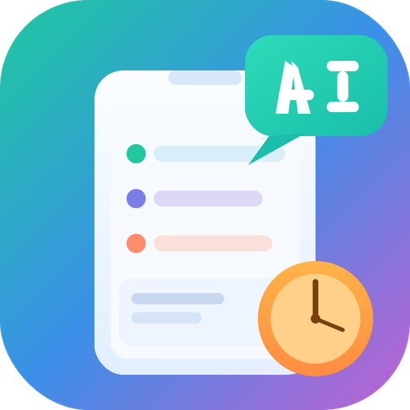

<p align="center">
  
</p>

<h1 align="center">LearnHelper - 刷题助手</h1>

<p align="center">一款 Android 刷题应用，支持多题库管理、智能刷题、AI 答疑和刷题分析。</p>

## 功能特性

### 刷题模式
- **顺序/随机刷题** — 随机模式基于持久化种子，关闭 App 重开进度不丢失
- **背诵模式** — 直接展示正确答案和解析，适合快速复习
- **单选/多选** — 自动识别题型，多选题需确认后提交
- **题库切换** — 顶部下拉快速切换题库，多题库时支持混合模式
- **结束统计** — 随时结束刷题，查看正确率和答题详情

### 错题本
- 答错自动收录，复习模式下答对自动移除
- 展开查看选项、答案、解析
- 支持编辑、删除、问 AI、一键复习

### AI 答疑
- 接入 OpenAI 兼容 API（支持所有主流大模型）
- **流式输出** — 逐字显示，输出完成后渲染 Markdown
- 聊天记录按题目持久化保存
- 可将 AI 回答设为题目解析

### 刷题分析
- 结束刷题后展示正确率、正确/错误题目列表
- **AI 智能分析** — 流式生成总体评价、薄弱知识点、错误原因分析、学习建议

### 题库管理
- **多题库** — 导入 JSON 文件，支持多个题库并存
- **题库内浏览** — 搜索、编辑、删除、新增题目
- **导入/导出** — 导入外部 JSON 题库，导出任意题库为 JSON
- **题目编辑** — 完整编辑器，支持标签、题号、题型、动态选项增删、答案、解析
- 刷题页面也可直接编辑/删除当前题目

### 大模型配置
- **多配置管理** — 添加多个大模型配置，随时切换
- **提供商模板** — 内置 OpenAI、Claude、Gemini、阿里云百炼、腾讯混元、DeepSeek、Grok、硅基流动、零一万物、Moonshot、智谱 AI 等模板，一键填充
- **参数调节** — 每个配置可设置 max_tokens、temperature、top_p 默认值
- **提示词管理** — 自定义答疑和分析提示词，支持参数覆盖（优先级高于配置默认值）
- **Token 统计** — 按 API 地址 + 模型名分组统计输入/输出/缓存 Token 消耗

## 题库 JSON 格式

```json
[
  {
    "tag": "计算机网络",
    "number": 1,
    "question": "在 OSI 参考模型中，负责数据加密/解密的是（ ）。",
    "options": { "A": "应用层", "B": "表示层", "C": "会话层", "D": "传输层" },
    "answer": "B",
    "type": "single",
    "explanation": "表示层负责数据格式转换、加密解密、压缩解压缩等功能。"
  },
  {
    "tag": "数据库",
    "number": 2,
    "question": "以下属于非关系型数据库的有（ ）。",
    "options": { "A": "MySQL", "B": "MongoDB", "C": "Redis", "D": "Oracle" },
    "answer": "BC",
    "type": "multi",
    "explanation": "MongoDB 是文档型数据库，Redis 是键值对数据库。"
  }
]
```

| 字段 | 必填 | 说明 |
|------|------|------|
| tag | 否 | 标签/分类 |
| number | 否 | 题号 |
| question | 是 | 题目内容 |
| options | 是 | 选项，如 `{"A": "...", "B": "..."}` |
| answer | 是 | 答案，单选 `"B"`，多选 `"BC"` |
| type | 否 | `"single"` 或 `"multi"`，默认单选 |
| explanation | 否 | 解析 |

App 内可导出示例 JSON 文件作为参考。

## 技术栈

- Kotlin + Jetpack Compose + Material3
- Room (SQLite) + KSP
- OkHttp (SSE 流式请求)
- Gson

## 构建

使用 Android Studio 打开项目，Sync Gradle 后直接运行。

- minSdk: 24
- targetSdk: 36
- Kotlin: 2.0.21

## 截图

*（待补充）*

## License

[Apache License 2.0](LICENSE)
